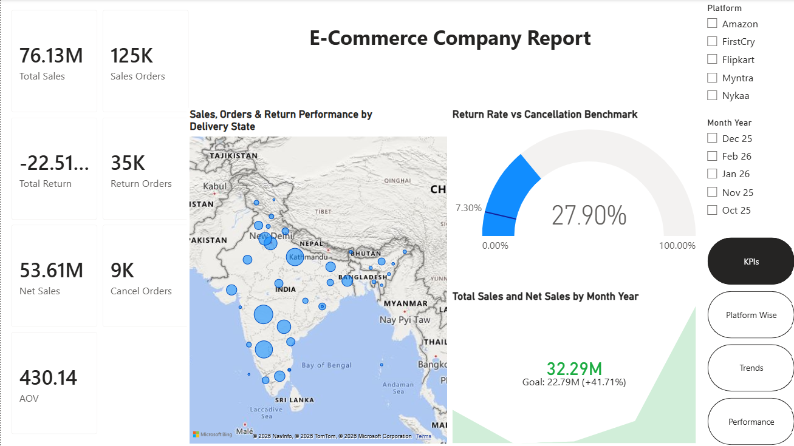

# Kids Wear Sales Dashboard

## Project Overview

This project is a real-time Power BI dashboard developed for a kids clothing brand.

The dashboard helps management monitor:

- Sales Performance
- Revenue
- Inventory
- Top Selling Products
- Low Performing Products
- Platform-wise Sales
- SKU Performance

## Tools Used

- Power BI
- Power Query
- DAX
- Excel

## Dashboard Preview

## Key KPIs

- Total Sales
- Revenue
- Quantity Sold
- Average Selling Price
- Top SKU
- Bottom SKU
- Inventory Remaining
